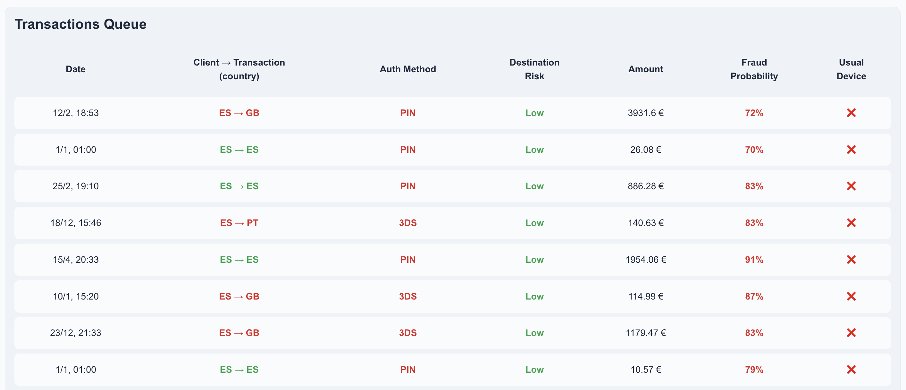
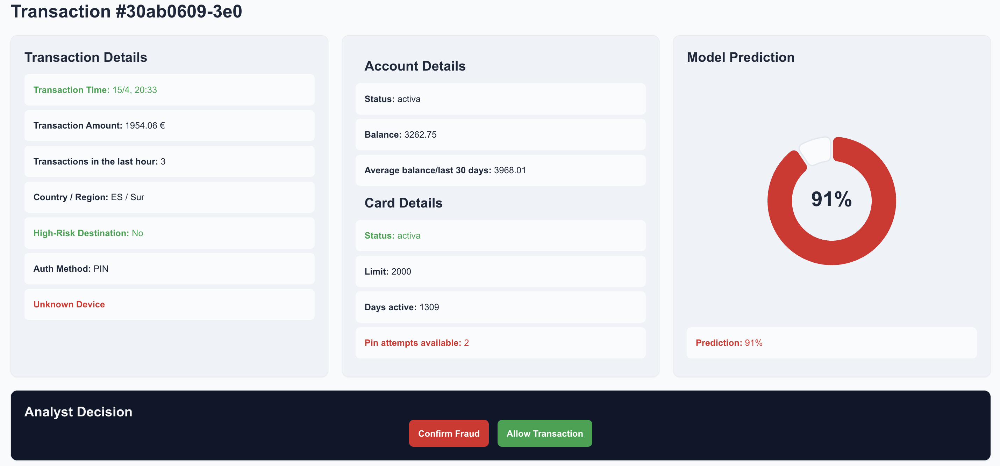

```markdown
# Sentinel — Fraud Detection Dashboard

Sentinel is a fraud detection dashboard designed to help financial analysts distinguish malicious banking transactions from false positives through risk analysis, prediction data, and analyst review workflows.

This project was developed as a collaborative Full Stack + Data Science + Cybersecurity challenge for **The Bridge Bootcamp**.

---

# Project Overview

Sentinel simulates an internal banking security platform where analysts can:

- Review suspicious transactions
- Analyze client and transaction metadata
- Visualize fraud prediction results
- Confirm or reject fraud alerts
- Update transaction review states in real time

The platform integrates:

- a React frontend,
- an Express REST API,
- a PostgreSQL database,
- and a machine learning fraud prediction pipeline.

---

# Screenshots

## Login Page


---

## Dashboard



---

## Transaction Detail



---

# Architecture Overview

```txt
React Frontend
        ↓
Express REST API
        ↓
PostgreSQL Database
        ↓
Fraud Prediction / ML Layer
```

The frontend consumes fraud analysis data generated and processed collaboratively by the Backend, Data Science, and Cybersecurity teams.

---

## Tech Stack

### Frontend Tech Stack
- React
- React Router DOM
- Vite
- Axios
- CSS Modules
- Motion
- D3
- Recharts
- Bootstrap Icons

### Backend Stack
- Node.js
- Express
- Sequelize
- PostgreSQL
- JWT Authentication
- HTTP-only Cookies
- Docker

### Repositories
- **Backend Repository:** https://github.com/BV-Works/grupo2-desafio-be
- **Data Science Repository:** https://github.com/CPasData/NovaPay_ML

---

## Features

### Authentication & Security
- JWT authentication
- HTTP-only cookie session handling
- Protected routes
- Persistent user session validation
- Secure API communication

### Dashboard
- **Transactions Table**
  - Paginated transaction visualization
  - High-risk transaction filtering
  - Risk-level visualization
  - Responsive overflow handling
  - Clickable transaction rows
- **Clients Table**
  - Paginated client overview
  - High-risk client visualization
  - Responsive table layout

### Transaction Detail View
- Detailed transaction metadata
- Prediction/risk analysis visualization
- Client information panel
- Analyst review workflow
- Fraud confirmation / false positive decisions

### Analyst Decision System
Analysts can:
- Confirm fraudulent activity
- Mark false positives
- Update transaction review state through API `PUT` requests

---

## Frontend Architecture

The frontend follows a component-based architecture with clear separation of concerns.

### Main Architectural Decisions

#### Services Layer
API communication is abstracted through reusable service modules:

```text
services/
├── auth.service.js
├── clients.service.js
└── transactions.service.js
```

This keeps:
- API logic separated from UI components
- components cleaner and easier to maintain
- backend changes isolated

#### Authentication Context
Global authentication state is handled through React Context API.

```txt
AuthProvider
     ↓
 useAuth()
     ↓
Protected Routes / Components
```

This centralizes:
- login
- logout
- user session handling
- authenticated state

#### Reusable UI Components
The application progressively evolved toward reusable UI primitives and layout abstractions:

```text
components/
├── TableShell
├── CardShell
├── DecisionModal
├── DecisionCard
├── TransactionCard
└── ClientCard
```

#### CSS Architecture
Styling uses:
- CSS Modules
- shared design tokens
- reusable spacing/shadow/radius systems
- responsive layout strategies

#### Responsive Design
The application was designed with responsive dashboard behavior in mind.

Current responsive features:
- adaptive dashboard grid
- stacked mobile layouts
- scrollable table containers
- responsive cards and modals

---

## Deployment

| Layer | Platform |
| :--- | :--- |
| **Frontend** | Netlify |
| **Backend** | Render |
| **Database** | Render |

---

## Environment Variables

Create a `.env` file in the project root:

```env
VITE_API_URL=your_backend_api_url
```

---

## Installation

1. **Clone repository**
   ```bash
   git clone [https://github.com/BV-Works/grupo2-desafio-fe.git](https://github.com/BV-Works/grupo2-desafio-fe.git)
   ```
2. **Install dependencies**
   ```bash
   npm install
   ```
3. **Start development server**
   ```bash
   npm run dev
   ```

---

## Project Structure

```text
src/
├── api/
├── components/
├── context/
├── layouts/
├── pages/
├── routes/
├── services/
├── styles/
├── utils/
└── data/
